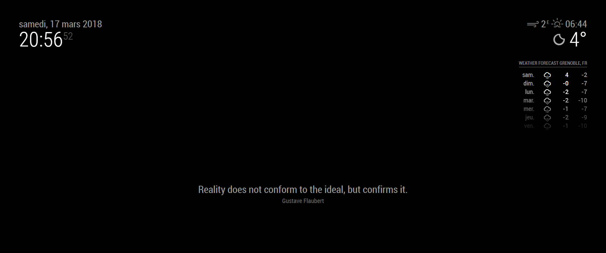

# MMM-quote-of-the-day

Module to get a random quote from various authorship.

This module is based on the [Forismatic](http://forismatic.com/en/) API.
Quotes are only available in English but they can be translated on the fly in the language of your choice. The translation is based on the Google API.
The quote is renewed following a configurable update interval.



## Installation

Clone this repo into `~/MagicMirror/modules` directory. Then move in the folder and install required libraries
```
cd MMM-quote-of-the-day
npm install
```

Configure your `~/MagicMirror/config/config.js`:

```js
{
    module: "MMM-quote-of-the-day",
    position: "lower_third",
    config: {
        language: "en",
        updateInterval: "1d"
	}
}
```

## Configuration option

| Option         | Default | Description                                                                                                                                            |
|----------------|---------|--------------------------------------------------------------------------------------------------------------------------------------------------------|
| language       | en      | [ISO-639-1 code of the language](https://cloud.google.com/translate/docs/languages) of the quote. Will be translated via google API if not set to "en" |
| updateInterval | 1d      | Time between each update of the quote. Composed by an integer followed by a letter "s" or "m" or "h" or "d" for second, minute, hour or day.           |

Example of `updateInterval`:
- **1d**: update the quote every day
- **4h**: update the quote every 4 hours
- **30m**: update the quote every 30 minutes


## External control

### From my module by using internal notification

You can send notification to this module via your own module. by using the `sendNotification` method.

Update the quote from my module:
```js
this.sendNotification("QUOTE-OF-THE-DAY", "getNewQuote")
```

### From MM API

To get a new quote from the API. Send a **POST** request to the **/quote-of-the-day** URI of your Magic Mirror

Curl example:
```
curl -H "Content-Type: application/json" -X POST -d '{"notification":"QUOTE-OF-THE-DAY", "payload": "getNewQuote"}' http://localhost:8080/quote-of-the-day
```

### From Kalliope

Here is an example of usage via [Kalliope assistant](https://github.com/kalliope-project/kalliope_neuron_magic_mirror)
```yml
  - name: "new-quote"
    signals:
        - order: "give me a new quote"
    neurons:
        - magic_mirror:
            mm_url: "http://127.0.0.1:8080/kalliope"
            notification: "QUOTE-OF-THE-DAY"
            payload: "getNewQuote"
        - say:
            message: "here is a new quote"
```

See an [example video here](https://youtu.be/eWxtJsHDU2o).
